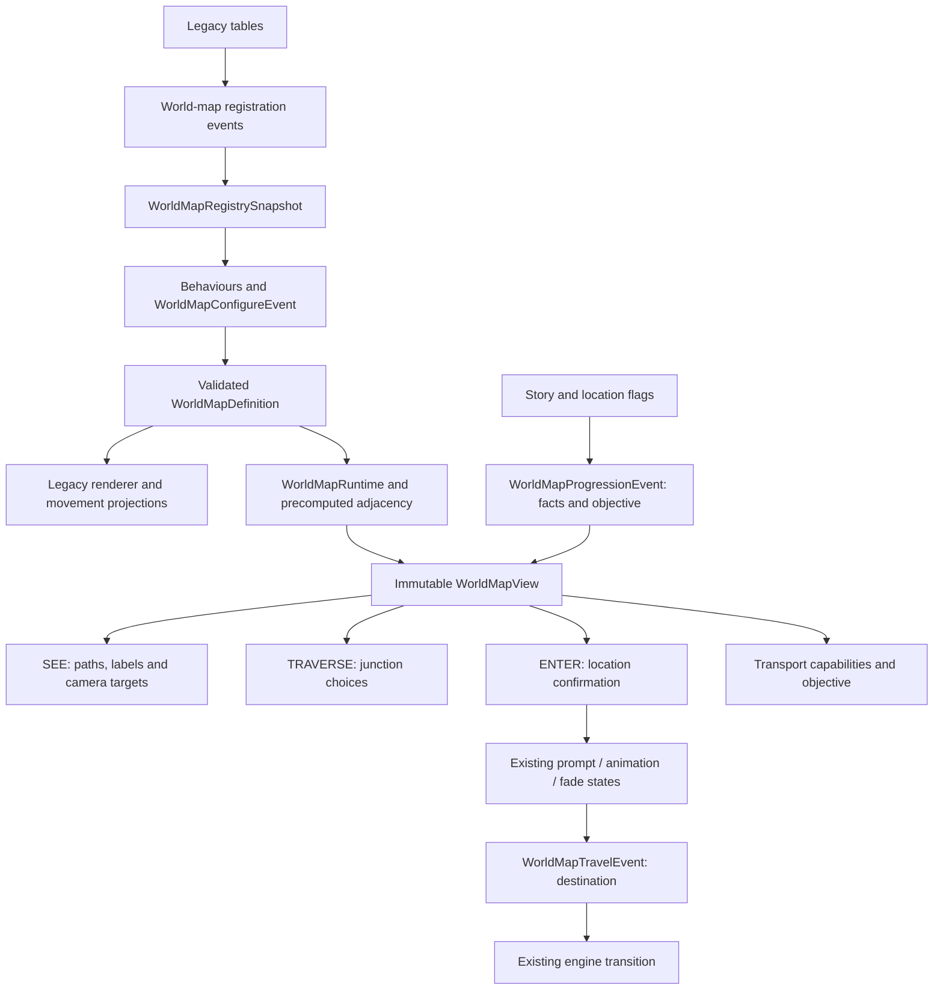

# World map definitions and runtime

Registry contracts, extension rules, and initialization ordering are documented in [world-map-registries.md](world-map-registries.md).

WMAP imports the retail tables into an immutable definition, resolves progression into an immutable view, and adapts those results to the existing map renderer, movement controller, and engine transitions. With no subscribing mods, retail story presets, route ordering, entry scenes, movement, encounters, and presentation remain the defaults.

## Responsibilities



Definitions distinguish place metadata, physical endpoint nodes, directed routes, geometry, and portals binding traversal to submap entry/exit data. Imported IDs use `lod:wmap_location_N`, `lod:wmap_route_N`, `lod:wmap_place_N`, and `lod:wmap_node_N`. Numeric suffixes identify legacy slots, not discovered semantic names. A shared place name does not imply that two portals have the same source, destination, story rule, or presentation.

`WorldMapDefinition` validates references, dense slot ordering, geometry, and directional endpoints. Collections are detached and immutable. Projection methods return fresh mutable arrays for WMap's legacy adapters. `WorldMapTraversal` precomputes adjacency while preserving legacy row order, duplicate bindings, facing filters, and endpoint tolerance.

## Mod lifecycle

Subscribe with SC's existing `@EventListener` mechanism. All three new events extend `InGameEvent<WMap>` and implement `WorldMapEvent`.

1. `WorldMapConfigureEvent` fires on each map initialization, including region reloads and newly constructed WMap states
2. Configure `event.definition` and `event.rules`; builders are frozen into a validated runtime after listeners return
3. `WorldMapProgressionEvent` supplies a new snapshot builder when raw flags change or a mod calls `invalidateWorldMap()`
4. Set named facts and optionally replace or hide the objective in that builder
5. Rendering, movement, location entry, and transport capabilities query the same resolved view
6. `WorldMapTravelEvent` lets a mod replace a concrete submap destination without replacing the engine's transition animation

Rules must be pure functions of their arguments. Do not query WMap recursively or mutate game state during progression resolution; recursive queries throw a lifecycle diagnostic. Store persistent custom facts in the mod's existing save data and copy them into the progression builder. The WMAP view is a cache, not another persistence owner. If only mod-owned facts change, call `event.getEngineState().invalidateWorldMap()` from the appropriate later event, or call `invalidateWorldMap()` on the active WMap.

Before initialization, use the configure event's builders. Public definition/view queries throw a useful error when the map has not been configured. Retaining a view gives a stable snapshot, not a live object; obtain a fresh one after invalidation. `WorldMapRuntime.validateIntent` is available to clients retaining a versioned choice; the engine itself re-resolves junction choices and rechecks entry access before accepting input.

### Separate visibility, movement and entry

Before, the same `wmapFlags_15c` bit controlled several consumers. A mod generally had to manipulate packed flags and account for story presets overwriting them.

After, a configure listener can install an explicit rule for an existing portal:

```java
final RegistryId gate = new RegistryId("lod", "wmap_location_7");
final RegistryId key = new RegistryId("example", "has_gate_key");
event.rules.portal(gate, (portal, action, progression) -> {
  if(action == WorldMapAction.SEE) {
    return WorldMapAccess.ALLOWED;
  }
  return progression.hasFact(key)
    ? WorldMapAccess.ALLOWED
    : WorldMapAccess.denied("The gate key is required");
});
```

In a progression listener, populate `event.progression.fact(key, hasGateKey)` from mod-owned state. A configured portal rule replaces that portal's default rule for all actions; explicitly preserve story access inside the rule when desired. Without a custom rule, all actions use the same retail availability bit.

`STORY` is the default policy. `event.rules.policy(WorldMapPolicy.OPEN)` bypasses only decisions classified as `STORY_LOCKED`. It does not bypass `RULE_LOCKED`, missing routes, continent checks, or transport capabilities. Use `WorldMapAccess.denied(reason)` for a hard mod requirement; return `STORY_LOCKED` only for a restriction intended to be bypassed by OPEN.

`queryWorldMap(portalId, action)` also applies the active continent and route-existence checks. `view.access(legacyIndex, action)` contains the resolved per-portal decision without the active-continent check. Legacy arrival lookup intentionally evaluates arrival eligibility independently of route existence: Queen Fury's arrival row 93 has no route, because its saved path is restored afterwards.

### Transport and objectives

Override `event.rules.capability(WorldMapTravel.Capability.COOLON, progression -> ...)` or `QUEEN_FURY_BOARDING` during configuration. Default capability checks retain their original story flags. OPEN does not grant these abilities.

The default objective retains the last matching story marker and its legacy map coordinates. In a progression listener:

```java
event.progression.objective(new WorldMapObjective(180, 96, "Find the gate key"));
// Or hide the marker without changing access to any route:
event.progression.objective(null);
```

Coordinates use the existing 320 by 240 world-map overlay coordinate system. A null label keeps the marker without a text label. The objective is independent of access rules and policy.

### Definition overlays

Obtain existing records through `LegacyWorldMap.importDefinition()` or retain the relevant baseline records while preparing the configure listener. Replace records with `event.definition.replacePortal(...)`, `.replaceRoute(...)`, or `.replacePlace(...)`. Portal helpers include `withSource`, `withDestination`, `withRoute`, `withPlace`, and `withPresentation`; places provide `withName`.

For example, a destination can change from direct mutation of `Location14.submapCutTo_08/submapSceneTo_0a` to:

```java
final WorldMapPortal portal = LegacyWorldMap.importDefinition().portal(7);
event.definition.replacePortal(portal.withDestination(new SubmapEndpoint(13, 17)));
```

The configure-event builder retains the established slots: it replaces existing records, geometry and nodes, and cannot append them. Use the world-map registries to add dense geometry, routes, places or encounter pools before the snapshot is created; portal projection remains fixed at 256 slots. Rules naming unknown portals fail during configuration. Geometry can be replaced with `.geometry(segmentIndex, points)` and existing nodes with `.node(node)`. Every directed route's start/end must still match the physical segment endpoints. Moving a shared junction requires updating all attached geometry and its node. Segment lengths are regenerated.

The registry pipeline can append nodes plus dense geometry, routes, places and encounter pools. It supports portal changes only by replacing one of the 256 legacy slots, including an unused portal slot with valid route/place bindings. Scripts, visited bits, encounter/model indices, thumbnails, transport destination lists, and rendering resources still use the established retail contracts. Mods must supply indices valid for those existing resources. New portal capacity beyond 256 requires a separate migration of those adapters.

Retail legacy tables are imported by Lod's registry listeners. Edits to `WmapStatics` after registration are not live changes to the active immutable definition. Register a world-map entry to supply or overlay graph/travel data; use `WorldMapConfigureEvent` for a per-configuration definition or rule adjustment; progression changes belong in rules/facts and invalidation. Registry overlays use explicit replacement priorities, while configure-event listeners retain mod-loader event order.

## Travel and closure semantics

Normal destination preparation remains at its existing engine call sites. A `LOCATION` travel event may therefore run during initialization and again when preparing the location prompt; it is not an entered-location notification. Listeners should only resolve the supplied destination and must not grant rewards or commit quest state there. Visited-location writes and actual engine handoff remain at their original stages.

Region menus retain their packed selection data internally. `REGION` fires once a concrete region has been selected, with `worldMapArrival=true`; its cut updates the global cut and its scene updates the collided-primitive/continent value, preserving the original global submap-scene behavior. Coolon also uses `worldMapArrival=true` for From-endpoint arrivals; its special destination index 8 retains To-endpoint/submap semantics. `FORCED_QUEEN_FURY` has no portal ID and runs at the original forced fade boundary. Queen Fury, Coolon, and teleport animation state machines remain engine adapters.

If a rule closes the active route during movement, the player finishes the current segment. Junction choices are resolved again against current progression before selection. With no permitted candidate, the player holds at the endpoint until a route becomes available; no invalid index is selected. A closed reverse route is not silently granted. Entry is checked when confirming the prompt, before fade and prompt teardown; accepted transitions retain the existing commit timing.

## Save compatibility

`WorldMapSave` retains `pathIndex`, `dotIndex`, `dotOffset` (float), `facing`, and `directionalPathIndex`. Configured maps additionally write `schemaVersion=1` and a stable `routeId`. Old readers can continue using the original fields; saves without metadata use the original loading path. Temporary engine instances used for memcard conversion write only the legacy fields.

When new metadata is present, initialization resolves the route ID in the configured definition and remaps route/segment indices, retaining dot index, offset, and facing. An unknown route, unsupported schema, or position outside the replacement geometry fails with a diagnostic instead of silently loading another route. Reordering/removing a mod route therefore requires retaining/migrating its stable ID; shortening geometry may invalidate existing positions. This is additive metadata, not a change to the global save serializer or script ABI.

## Validation

Run `gradlew.bat wmapCompatibilityTest assemble`. The dedicated test task avoids the repository's default exclusion of all tests and does not launch the game. It compares the imported model and resolver to an independent legacy-table oracle over all 49 presets, pairwise precedence, 256 location slots, continents, endpoint positions, ordered junction candidates and facings. It also covers OPEN overflow beyond seven candidates, separate access decisions, stale snapshots, dynamic closures, objectives, topology overlays, travel classification, arrivals, save round trips/remapping, and invalid definitions.

These checks establish data and resolver parity. They do not establish visual timing, controller feel, all disc transitions, battle returns, or third-party mod compatibility. Those require gameplay testing with the target assets and mods before merging.

The implementation was validated on 2026-09-10 against main baseline `32f502966db74c8145a1b46c38e5f950291699ee`: 885,957 compatibility assertions passed and `assemble` succeeded. An isolated packaged-engine smoke run reached WMAP `PLAY`, player `RENDER_5`, and enabled input; directional input moved path 1 from dot 0/offset 0 to dot 4/offset 3.6666667, then offset 3.0. The run advanced 257 ticks without crashing. It detected an intersection but did not verify switching to another path. Temporary harness files and logs are in `C:\temp\wmap-runtime-smoke`; no user saves or external mods were loaded.

## Changed surfaces

- `WMap.java`: definition import, view lifecycle, availability consumers, adjacency selection, travel and save adapters, objective rendering
- `MapState100.java`: growable junction scratch buffers for valid states with more than seven bindings
- `world/`: immutable definition records, legacy importer, rules/progression/view/runtime, traversal, story/presentation/objective/travel/save boundaries
- `WorldMapConfigureEvent`, `WorldMapProgressionEvent`, `WorldMapTravelEvent`: standard SC mod lifecycle seams
- `WorldMapCompatibilityCheck`, `WorldMapCompatibilityTest`, and the dedicated Gradle task: repeatable compatibility validation
- This document: contracts, examples, migration boundaries and verification scope

The new files under `src/main/java/legend/game/wmap/world/` are:

```text
LegacyWorldMap.java       SubmapEndpoint.java       WorldMapAccess.java
WorldMapAction.java       WorldMapDefinition.java    WorldMapNode.java
WorldMapObjective.java    WorldMapPlace.java         WorldMapPoint.java
WorldMapPolicy.java       WorldMapPortal.java        WorldMapPresentation.java
WorldMapProgression.java  WorldMapRoute.java         WorldMapRule.java
WorldMapRules.java        WorldMapRuntime.java       WorldMapSave.java
WorldMapStory.java        WorldMapTravel.java        WorldMapTraversal.java
WorldMapView.java         package-info.java
```
